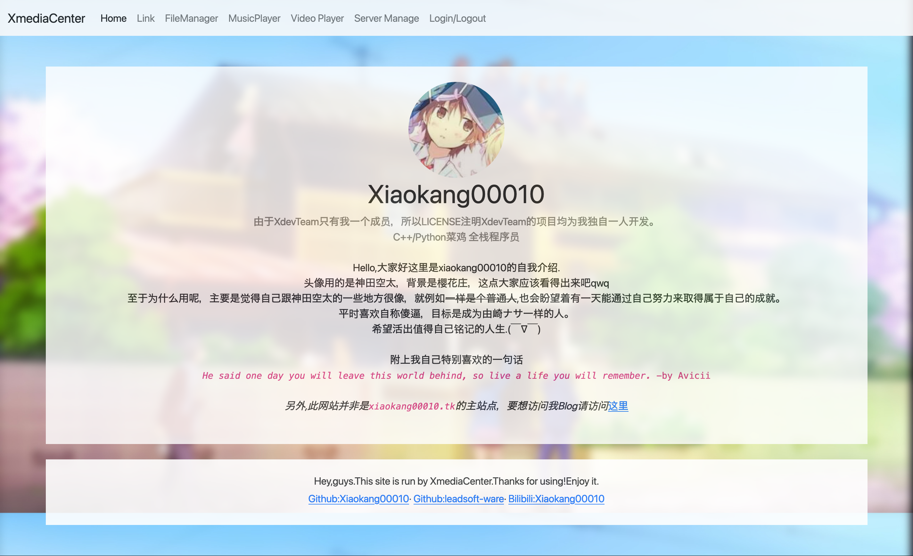
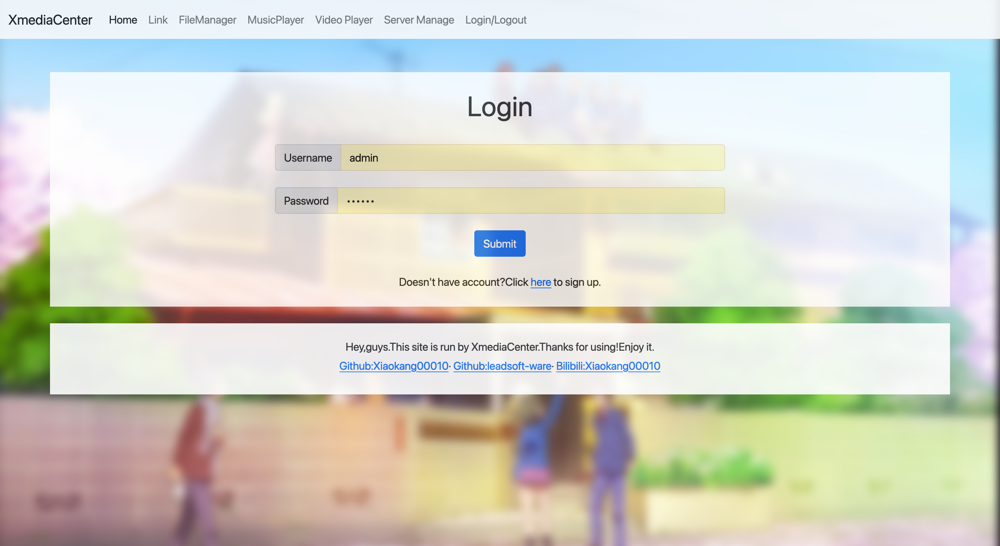
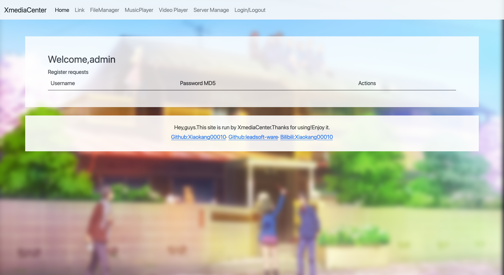
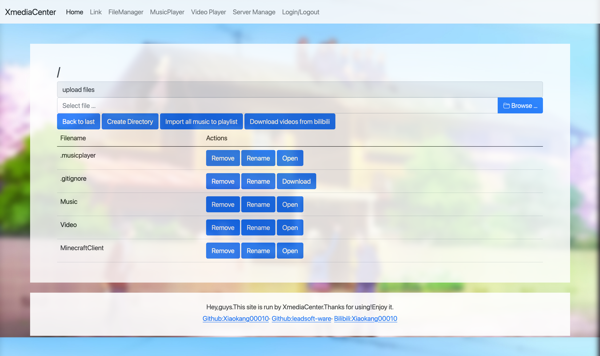
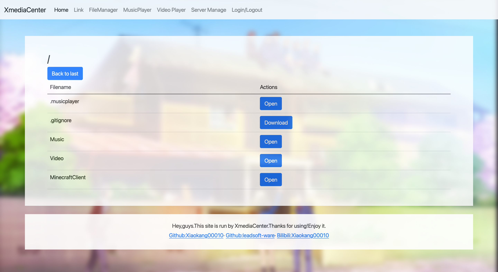
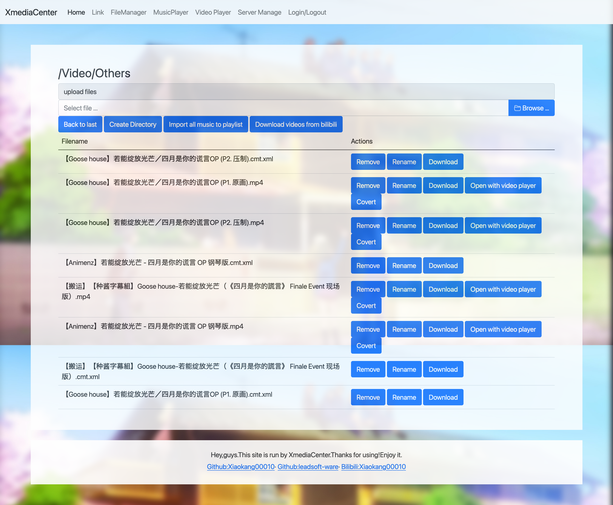
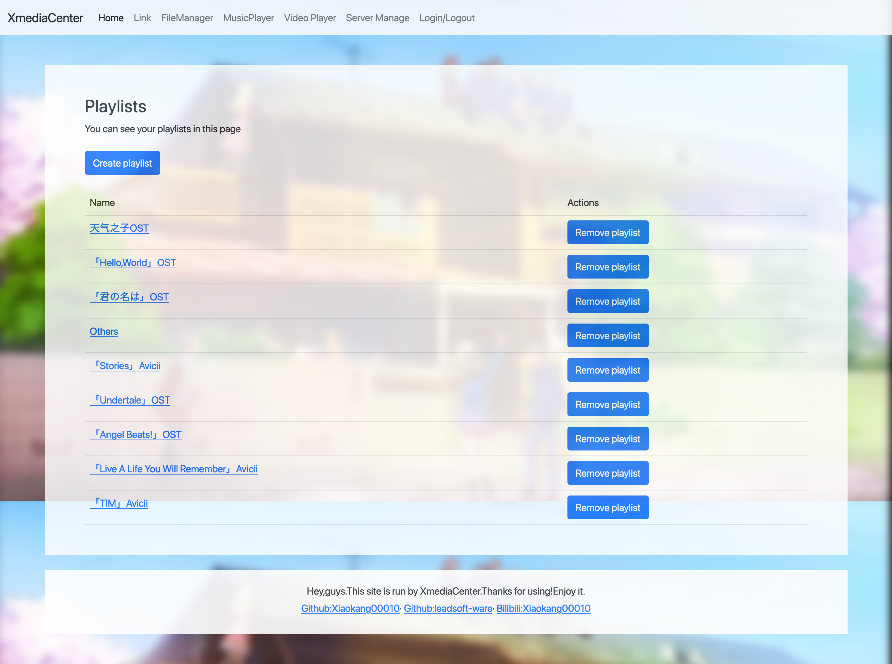
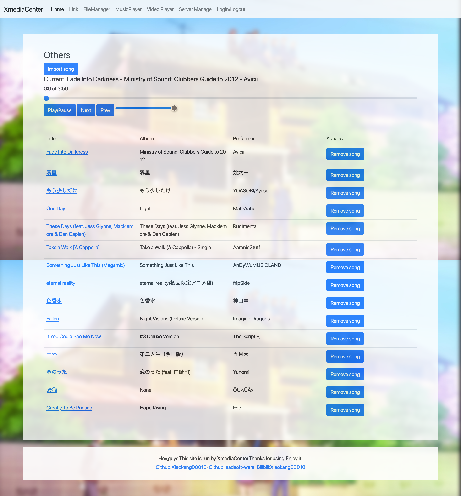

# XmediaCenter README

# The opensource projects in this repository

- dplayer (//github.com/DIYgod/DPlayer/) - Licensed under the MIT license

### What's XmediaCenter？
XmediaCenter is a project to replace netease cloud music , bilibili and more applications.

### Features
- modular design
- plugin support
- Bilibili Videos Downloader with you-get
- Bilibili Videos Covert with ffmpeg , <em>I thought it likes a frontend of ffmpeg better</em>
- Basic user managent system
- Basic File manager
- Music player with playlist support
- Video player(dplayer) with damuku
- Bilibili damuku coverter
- Guest mode
- Opensource with **Anti-996** License

### Is there any stable release?
We're still developing.There are not stable releases yet.

<s>**不会吧不会吧，不会真的有人那么闲去看我README吧，不会吧？**</s>

### There are some screenshots

